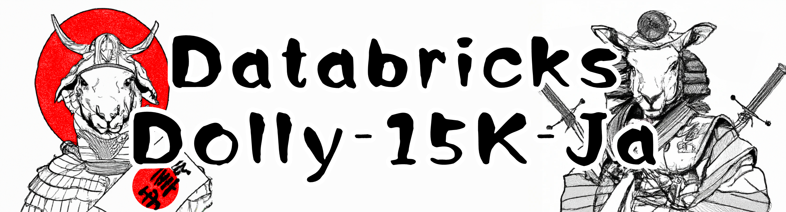

# databricks-dolly-15k-ja

databricks/dolly-v2-12b の学習データに使用されたdatabricks-dolly-15k.jsonl を日本語に翻訳したデータセットになります。  日本語大規模言語モデルの作成にご活用下さい。なお、データセットのライセンスは、翻訳元のデータセットのライセンスを継承し`CC BY SA 3.0`になります。

This dataset can be used for any purpose, whether academic or commercial, under the terms of the `Creative Commons Attribution-ShareAlike 3.0 Unported License`.

**データセット内で翻訳誤り、誤字、脱字、文脈の違和感等あるレコードがあった場合はPull requests いただけると助かります（英語弱者なのでPRは日本語で大丈夫です）。**

**huggingface**  
https://huggingface.co/datasets/kunishou/databricks-dolly-15k-ja  

Dollyデータセットとこれを日本語に翻訳したときのデータを活用して作成した69Kの翻訳タスクデータセットも公開しています。databricks-dolly-15k-ja にマージしてファインチューニングを行うことで翻訳タスクもできるLLMを作ることができると思います。なお、こちらのデータセットは databricks-dolly-15k-ja の更新のタイミングで再作成を実施し、huggingface上のデータセットも最新のものに差し替えます。

**databricks-dolly-69k-ja-en-translation**    
https://huggingface.co/datasets/kunishou/databricks-dolly-69k-ja-en-translation
